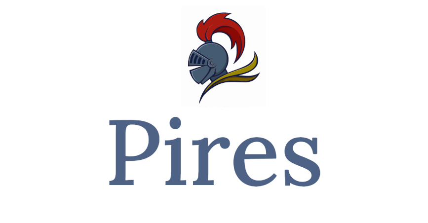

Pires is a C compiler that hopes to implement most C99 features.

## Features roadmap

- Data Types:

  - Primitive data types: int, float, char, double, etc.
  - Derived data types: arrays, structures, unions, enumerations, and pointers.
  - User-defined data types using typedef.

- Control Flow:

  - Conditional statements: if-else, switch-case.
  - Looping constructs: for, while, do-while.

- Functions:

  - Function declaration and definition.
  - Parameter passing: pass by value, pass by reference.
  - Return types: void, int, etc.
  - Recursive functions.

- Operators:

  - Arithmetic operators: +, -, \_, /, %.
  - Relational operators: <, >, <=, >=, ==, !=.
  - Logical operators: &&, ||, !.
  - Bitwise operators: &, |, ^, <<, >>.
  - Assignment operators: =, +=, -=, \_=, /=, %=, etc.

- Input and Output:

  - Standard input/output functions: printf, scanf, etc.
  - File input/output: fopen, fclose, fread, fwrite, etc.

- Memory Management:

  - Dynamic memory allocation: malloc, calloc, realloc, free.

- Preprocessor Directives:

  - Macros: #define, #ifdef, #ifndef, #endif, etc.
  - Include files: #include.

## Internals

- Tokenize: A tokenizer takes in a string and outputs a list of tokens
- Parse: A recursive descendent parser takes in a list of tokens and constructs ASTs
- Codegen: A code generator emits an RISC-V assembly text for given AST nodes

References

- [chibicc](https://github.com/rui314/chibicc)
